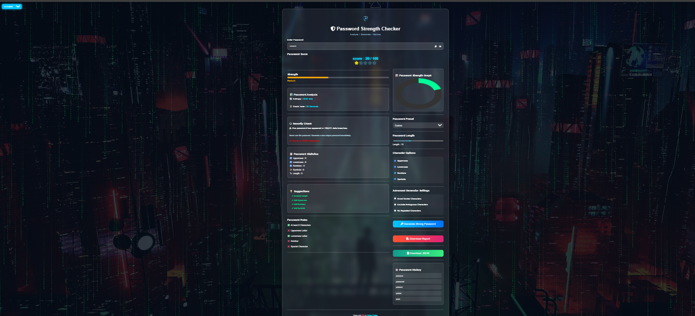
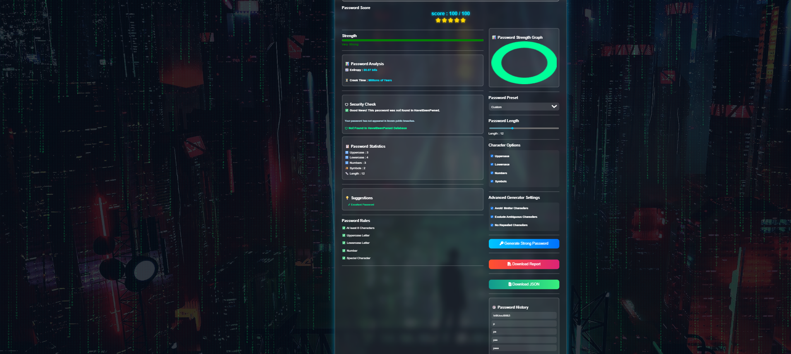
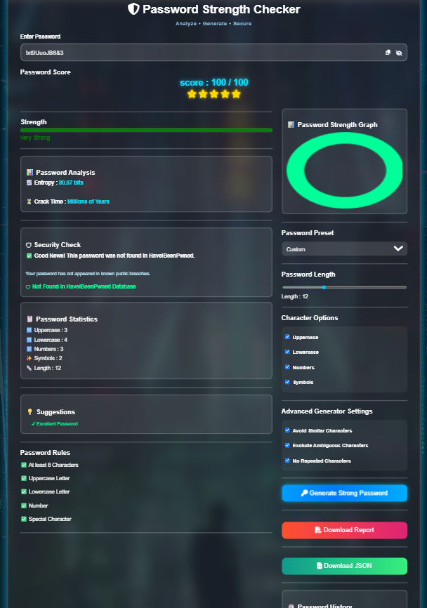
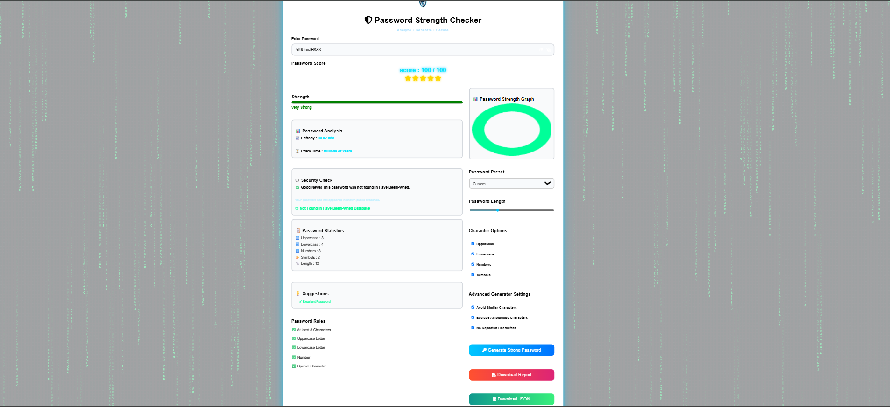

# 🔐 Password Strength Checker

A modern **Password Strength Checker** built with **Flask, HTML, CSS, and JavaScript**.

This application analyzes password strength in real time, estimates crack time, calculates password entropy, checks whether a password has appeared in known data breaches using the **Have I Been Pwned API**, and generates highly secure passwords.

---

# 🌐 Live Demo

🚀 **Try the Live Application Here**

https://password-strength-checker-1-e1gu.onrender.com/

---

# ✨ Features

- 🔒 Real-Time Password Strength Analysis
- ⭐ Password Score (0–100)
- 📊 Animated Strength Meter
- 📈 Password Entropy Calculation
- ⏳ Password Crack Time Estimation
- 🛡️ Have I Been Pwned (HIBP) Breach Check
- 📋 Password Statistics
- 💡 Smart Password Suggestions
- 📜 Password History (Local Storage)
- 📄 Download PDF Report
- 📁 Export JSON Report
- 🌙 Dark / Light Mode
- 🌧️ Matrix Hacker Rain Background
- 🔑 Strong Password Generator
- 📱 Fully Responsive Design
- 🌍 English / Hindi Language Support
- 📊 Password Strength Graph (Chart.js)

---

# 🛠️ Tech Stack

- Python
- Flask
- HTML5
- CSS3
- JavaScript (ES6)
- Chart.js
- jsPDF
- Have I Been Pwned API
- Render

---

# 📷 Screenshots

## 🏠 Home



---

## 📊 Password Analysis



---

## 🔑 Password Generator



---

## 🌙 Light Mode



---

# 📦 Installation

Clone the repository

```bash
git clone https://github.com/Aman03625/Password-Strength-Checker.git
```

Go to the project folder

```bash
cd Password-Strength-Checker
```

Install dependencies

```bash
pip install -r requirements.txt
```

Run the application

```bash
python app.py
```

Open your browser and visit

```
http://127.0.0.1:5000
```

---

# 📁 Project Structure

```
Password-Strength-Checker
│
├── app.py
├── requirements.txt
├── LICENSE
├── README.md
│
├── templates
│      └── index.html
│
├── static
│      ├── style.css
│      ├── script.js
│      └── images
│             ├── cyber.jpg
│             └── logo.png
│
└── screenshots
       ├── home.png
       ├── ANALYSIS.png
       ├── GENERATE-PASSWORD.png
       └── LIGHT-MODE.png
```

---

# 🚀 Future Improvements

- 🔑 Password Manager Integration
- 🤖 AI-based Password Suggestions
- 📧 Email Strength Checker
- ☁️ Cloud Password History
- 🎨 Multiple Themes
- 🔐 Two-Factor Authentication Support
- 📱 Progressive Web App (PWA)

---

# 👨‍💻 Author

**Aman Yadav**

🔗 GitHub Profile  
https://github.com/Aman03625

📂 Project Repository  
https://github.com/Aman03625/Password-Strength-Checker

🌐 Live Demo  
https://password-strength-checker-1-e1gu.onrender.com/

---

# 🤝 Contributing

Contributions are welcome!

1. Fork the repository
2. Create a new feature branch
3. Commit your changes
4. Push your branch
5. Open a Pull Request

---

# 📜 License

This project is licensed under the **MIT License**.

---

⭐ **If you like this project, please consider giving it a Star on GitHub!**
